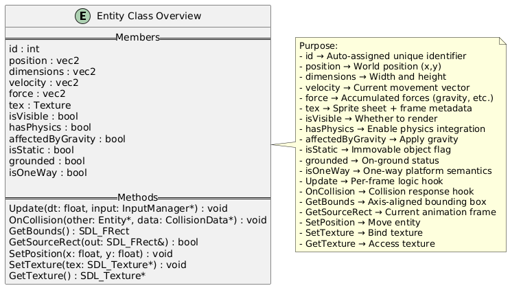

# Task 1: Core Graphics Setup
**How:** Initialized SDL3, created a 1920×1080 resizable window and renderer, and built a main loop that handles events, updates input/physics, and clears the screen to blue before rendering entities.

**Where:** Implemented in `GameEngine.cpp` `(Initialize, Run, Render, Shutdown)`, with scaling and clear color handled in `Render.cpp`. Usage shown in `main.cpp`.

**Why:** Centralizing setup in the engine ensures clean initialization/teardown, consistent rendering each frame, and a portable structure that can scale to future features without rewriting the main loop.

# Task 2: Generic Entity System
**How:** Created a base `Entity` class with position, dimensions, velocity, texture data, and flags for physics/collision. `Entities` override `Update` and `OnCollision` as needed. Rendering and physics operate generically on all entities.

**Where:** Defined in `Entity.h`, integrated in the engine update loop `(GameEngine::Update)` and rendering `(RenderSystem::RenderEntity)`. Subclass examples are `TestEntity` and `Platform` in `main.h` and `main.cpp`.

**Why:** Using a generic entity abstraction means the engine doesn’t need to know about specific game objects, making the system modular, reusable, and easy to extend with new object types.

# Task 3: Physics
**How:** Physics system kept relatively simple. Kept as simple forces across both axes. The system uses a basic force-based approach where entities have velocity and force vectors `(vec2)` that are applied over time. The `ApplyPhysics` method in `src/Physics.cpp (lines 4-21)` integrates forces into velocity using velocity = velocity + force * deltaTime (line 13), then updates position using position = position + velocity * deltaTime (line 18). The system supports gravity through a default downward force of 9.8 * 300.0 applied to entities that are affected by gravity, as seen in the `Entity` constructor in src/`Entity.h (lines 46-48)`. Entities can be marked as static (no physics applied) or have physics disabled entirely through boolean flags like `hasPhysics` and `isStatic` checked in the physics method (lines 5-6).

**Where:** The physics implementation is located in `src/Physics.h (lines 1-9)` and `src/Physics.cpp (lines 1-21)`, with the main `PhysicsSystem` class containing a single `ApplyPhysics` method. Physics properties are defined in the Entity class in `src/Entity.h`, including velocity and force vec2 members (lines 29-30), along with physics control flags like `hasPhysics`, `affectedByGravity`, and `isStatic` (lines 35-37). The system uses the custom vec2 struct defined in `src/vec2.h` (lines 4-7) for 2D vector operations, with supporting functions like add and mul (lines 9, 19) providing a clean abstraction for position, velocity, and force calculations.

**Why:** This simplified approach was chosen to maintain performance and code clarity while providing sufficient physics simulation for a 2D game. By using basic force integration rather than complex physics engines, the system remains lightweight and predictable. The vector-based approach allows for easy extension to more complex physics behaviors while keeping the core implementation straightforward. The boolean flags provide flexibility to disable physics for UI elements or create static objects without the overhead of physics calculations.

# Task 4: Input
**How:** Input system uses SDL3's keyboard state management with frame-based input detection. The InputManager class in src/Input.h (lines 5-17) provides three key methods: IsKeyPressed for continuous key states, IsKeyJustPressed for single-frame key presses, and IsKeyJustReleased for key release detection. The system maintains a previousKeyState unordered map (line 8) to track key states between frames, enabling precise input timing. The Update method in src/Input.cpp (lines 7-20) fetches the current keyboard state from SDL3 using SDL_GetKeyboardState (line 10) and stores previous frame states for comparison. Input is integrated into the game loop in src/GameEngine.cpp where input->Update() is called each frame (line 61) and passed to entity update methods (line 77).

**Where:** The input implementation is located in `src/Input.h` (lines 1-17) and `src/Input.cpp` (lines 1-51), with the main `InputManager` class managing keyboard state. The system is initialized in the `GameEngine` constructor in `src/GameEngine.cpp (line 36)` and integrated into the main game loop (lines 56-61). Input is passed to entities through the Update method signature defined in `src/Entity.h (line 55)`, allowing entities like the player character in `game/main.h` to receive input for movement and actions. The system uses SDL3's scancode-based input system, providing platform-independent key detection through SDL_Scancode enumeration.

**Why:** This frame-based input system was chosen to provide precise control over game actions, distinguishing between continuous input (like holding a movement key) and discrete actions (like jumping or shooting). By tracking previous frame states, the system can detect the exact moment a key is pressed or released, preventing input lag and ensuring responsive gameplay. The SDL3 integration provides cross-platform compatibility while the scancode-based approach ensures consistent behavior across different keyboard layouts. The modular design allows entities to easily access input state without tight coupling to the input system implementation.

# Task 5: Collision
**How:** Check if there is an overlap between the bounding boxes. If there is, check the axis along which the bounds penetrate each other the least. If both bodies are dynamic, push out both the bodies along the axis by half of the penetration distance. If any one of the bodies is static, push only the other one. After collision resolution, call virtual `OnCollision` methods implemented by the `Entity` class for a collision response.

**Where:** In `Collisions.cpp`, in the function `CollisionSystem::ProcessCollisions`.

**Why:** Enables the GameEngine to avoid overlapping entities, while providing enough flexibility for the Game developer to create their own collision resolution functions.

# Task 6: Scaling
**How:** 
The `CalculateRenderRect` function in the `RenderSystem` calculates the correctly scaled destination rect of the entity to be rendered, taking into account the current screen width and height if the `ScalingMode` variable equals `PROPORTIONAL`.

**Where:** 
In Render.h, implemented by `RenderSystem::CalculateRenderRect` function.
In `GameEngine.cpp`, in `GameEngine::Render`, the keyboard is queried for keys `0` and `9` to set scaling mode to either `CONSTANT_SIZE` or `PROPORTIONAL` respectively. Depending on the scaling mode, the screen width and height are updated using `SDL_GetWindowSize`. 

**Why:** 
This enables adaptivity of the game engine to run in different resolutions. This could also potentially allow the Game developer using the engine to introduce innovative mechanics involving resizing the window.

